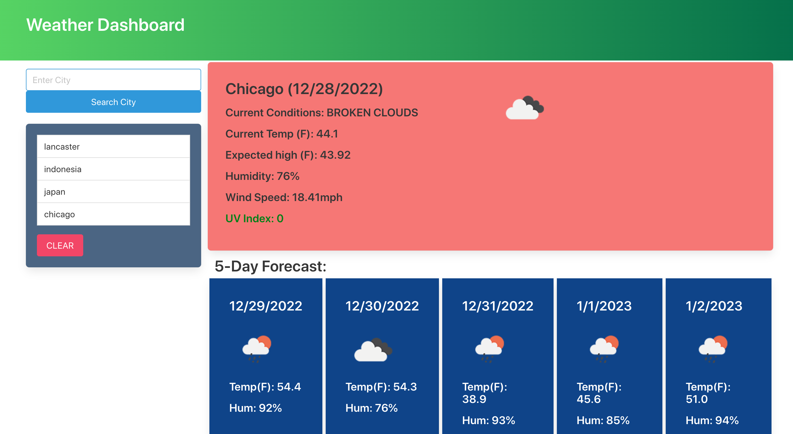

# Weather-Dashboard 
  
## Description
The Application is basically a five day weather day forecast program    with predictions of what the next five day will look like.

Deployed link:  [https://nasiromar.github.io/Weather-Dashboard/]
               
## Table of Contents
* [Installation](#installation)
* [Usage](#usage)
* [Contribution](#contribution)
* [Tests](#tests)
* [Credits](#credits)
* [License](#license)
* [Questions](#questions)
## Installation
Set up a repository in github and clone it on to your computer. open your vscode. make a index.html, script.js, style.css and once you've set up files and have specific code in each and every one of those files. then right click your index.html file and open it in the browser and you should then have your application pop up on your screen fully functional.
## Usage
Type in to the search bar what city your looking to see what the weather is looking like in that region and it will show you a five day weather broad cast of what those days will look like. the you can either keep on searching different locations or you can clear your search history and start all over again.

## Contribution
For any future improved developments or bugs please message us at me and my peers emails .
## Tests
There where no tests in this project. 
## Credits
none
## License
none

## Questions
If you have questions, please reach out via email or my GitHub account.
* GitHub: [nasiromar](https://github.com/nasiromar)
* E-mail: [nasiromar321@gmail.com](mailto:nasiromar321@gmail.com)

    
